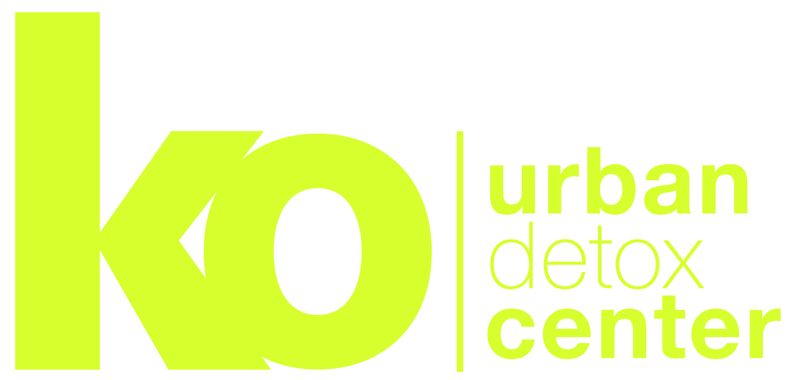
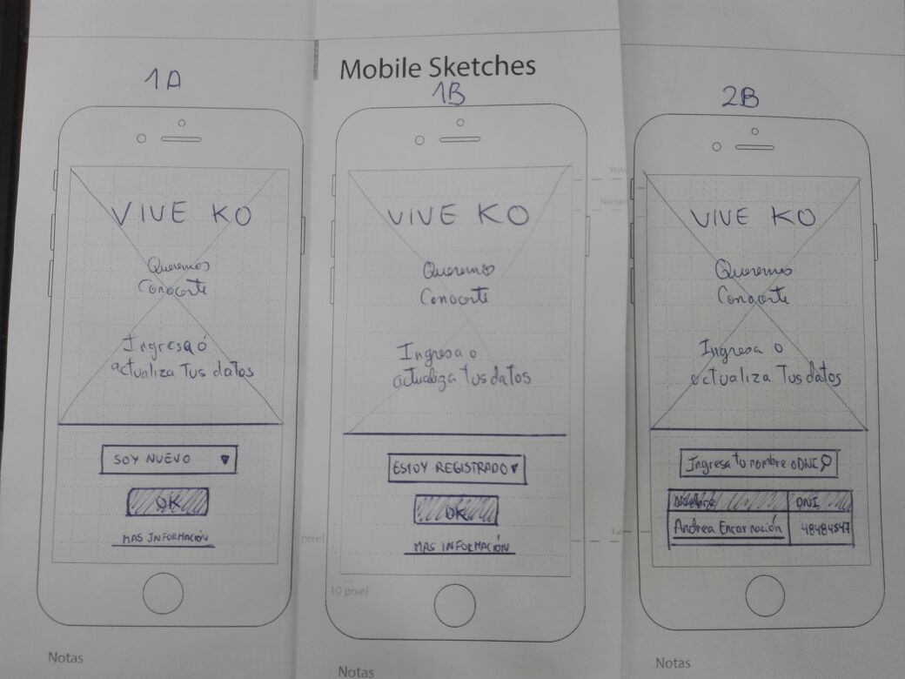
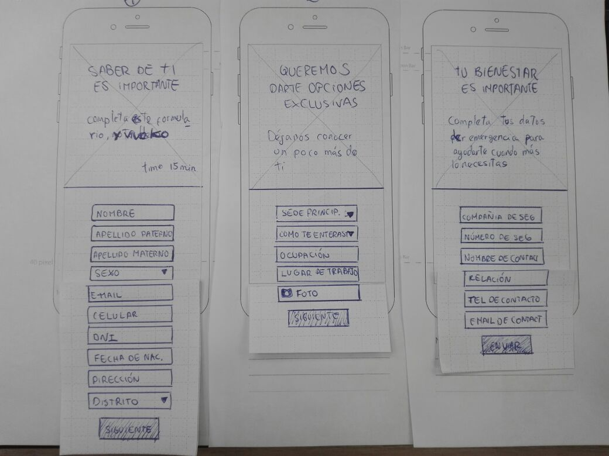
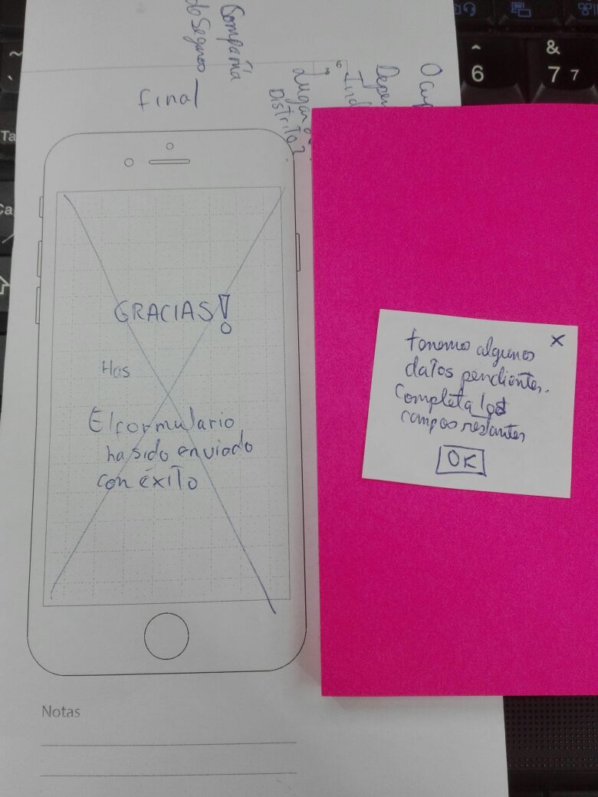

# KO: Actualización de Base de Datos

## RETO FRONT END:

Crear un formulario para la actualización de una base de datos de 5000 clientes ya existentes. 
Todo esto debe ser generado por el cliente mismo desde la comodidad de su casa, trabajo o donde quiera, teniendo en cuenta que el cliente ya existe, debemos de generar una pre validación en el sistema MindBodyOnline, para hacer así el paso a paso, en caso contrario el cliente nuevo deberá completar todos los campos existentes.

## RETO UX:

Este formulario va a ser más que el medio para capturar datos, debe reflejar la cultura de KO que es la esencia del mismo y de sus clientes.
Siendo tantos los datos necesarios para que KO cumpla su objetivo, este formulario se vuelve tedioso y poco amigable, algo que debe trabajarse para lograr el mayor número de actualizaciones.

# RESEARCH:

### SITUACIÓN ACTUAL
<http://iliveko.com/teresa/actualizardatos/>

### “TRAIN FOR HAPPINESS”
### “In & Out”

Pilares:
1.	Deporte intenso
2.	Conexión interior
3.	Alimentación consiente
4.	Actitud positiva

### Historia
<http://www.iliveko.com/historia.html>

## TIPOS DE USUARIOS

1.	Usuario fidelizado: es aquel que vive KO, y que a pesar de ser un formulario extenso estaría dispuesto a completarlo gracias a la identificación que siente con la empresa.
2.	Usuario que prueba y está en camino a convertirse en KO: este usuario gusta de la filosofía de KO, pero, por ser nuevo aun duda de algunos aspectos para llenar un formulario tan extenso, a ellos son a los que debemos ofrecerles seguridad 100%.
3.	Usuario inactivo (ex KO): Este usuario estuvo o no fidelizado con KO y por algún motivo dejó de lado esta parte de su vida, con la actualización de sus datos se espera buscar recuperar a este usuario.

### Mentalidad Deportiva:

La mentalidad de un deportista es muy importante en el logro de sus metas. Pensar en positivo le permite considerarse el mejor en la competencia, el 90% de su éxito deportivo, se debe a su capacidad y entrenamiento mental.
Un deportista tiene motivación, Autoconfianza, control emocional y concentración.

### Preguntas para la entrevista

1.	¿Cómo conociste a KO?
2.	¿Cuál crees que es el principal aporte que KO le da a tu vida?
3.	¿Cómo crees que contribuyes tu a KO?
4.	¿Qué cosas crees que KO debe mejorar?
5.	¿Qué es lo que más te gusta de KO?
6.	¿Frecuentas su web?
7.	¿Con que fin la frecuentas?
8.	¿Desde qué dispositivos la usas?
9.	¿Crees que KO tiene una buena comunicación con sus clientes? ¿Porque?
10.	Del 1 al 10 ¿Cuánto confías en KO? ¿Porque?
11.	¿Con respecto a lo anterior estarías de acuerdo en brindar datos para que mejore tu experiencia?
12.	¿Cómo crees que esta solicitud debe ser presentada?
13.	¿Cuánto tiempo debería tomarte?
14.	Duda o consulta

## INFORMACIÓN SOBRE FORMULARIOS

### Aspectos a tomar en cuenta para un formulario exitoso

| ASPECTOS | LOGROS|
|:------------:|:----:|
| Tener un objetivo claro | ok | 
| Inspirar confianza | ok | 
| Tener una correcta estructura | 3 secciones (datos personales, datos extra, datos de emergencia) | 
| Tener los campos correctos y necesarios | o	Es un formulario bastante grande por lo cual se hace tedioso |
| Usar labels | ok | 
| Usar botones (envío y regreso) | Falta botón de regreso | 
| Validar campos | Los mencionados abajo | 
| Tener una confirmación de envío | ok | 

**Se debe validar en tiempo real**

1.	E-mail (que contenga arroba y .com)
2.	Celular (9 dígitos)
3.	DNI CE (hasta 12)
4.	Número de seguro (pendiente)
5.	Teléfono de contacto (9 dígitos)
6.	E-mail de contacto (que contenga arroba y .com)

### FUENTES
<>

## PREGUNTAS A RESPONDER

Este debe de ser el momento en el que KO piensa en una estrategia para lograr el mayor número de actualización de datos.

**Algunas sugerencias:**

1.	¿Cómo hacer llegar el formulario?
a.	Mediante un link el cual será enviado por mail.
b.	Que se encuentre dentro de la estructura de la página
c.	En recepción con algún dispositivo de uso común
d.	Link vía Whatsapp
e.	Link vía Facebook
f.	Publicaciones de los Trainers
2.	¿Cómo hacer que empiecen a llenarlo?
a.	Cumpliendo con una campaña de difusión interna y en redes
3.	¿Cómo hacer que terminen de llenarlo?
a.	Ofreciendo recompensas por ello (sorteos o pequeños regalos)
4.	¿Cómo hacer que sea amigable y no pierda la esencia de KO?
a.	Siguiendo una guía de estilos ya reconocida por sus usuarios

## IDEAS Y ACLARACIONES

1.	Hacer con transiciones los títulos
2.	Poner una barra de estado
3.	Tomar tiempos
4.	Opción de MAS INFORMACION (aclarar para que necesitamos esos datos)
5.	Ofrecer recompensas por completar el formulario (tomatodos, toallas, fix, polos, guantes, clase gratis)
6.	Cerciorarme de porque necesitan cada dato (verificar cada campo)
7.	Que al ingresar su nombre como usuario puede que haya un error con el nombre (es importante tener más de una opción de búsqueda para actualización de datos)
8.	Ver la sede y ser consiente que pueden usar muchas, pero una es su sede principal donde manejaran sus datos.
9.	Se puede enviar el formulario con un porcentaje de datos, pero solo serán acreedores de la recompensa aquellos que lo completen al 100%.
10. Verificar si el número de seguro es realmente importante.

# IDEACIÓN

## DATOS NECESARIOS

* Nombre:
* Apellido Paterno:
* Apellido Materno:
* Sexo:
* Fecha de nacimiento: 
* Dni / Ce:
* Dirección:
* Distrito:
* E-mail:
* Celular:
* Tu sede principal:
* Cómo te enteraste de KO:
* Ocupación:
* Lugar de trabajo (empresa):
* Foto:
**INFORMACIÓN PARA EMERGENCIAS**
* Compañía de seguro:
* Número de seguro:
* Nombre de contacto
* Relación
* Teléfono de contacto
* Email de contacto

## AGRUPACION DE DATOS

| Datos Personales | Datos de preferencias | Datos de Seguridad |
|:-------------|:----:|:----:|
| Nombre | Tu sede principal | Compañía de seguro |
| Apellido Paterno | Cómo te enteraste de KO | Número de seguro |
| Apellido Materno | Ocupación | Nombre de contacto |
| Sexo | Lugar de trabajo (empresa) | Relación |
| Fecha de nacimiento | Foto: | Teléfono de contacto |
| Dni / Ce |  | Email de contacto |
| Dirección |  |  |
| Distrito |  |  |
| E-mail |  |  |
| Celular |  |  |

## FLUJO

1.	Invitación a actualizar los datos (link)
2.	Filtro (registrado y no registrado)
3.	El no registrado completa todos los campos del formulario
4.	El registrado tiene los campos que llenó antes completados y los no completados enmarcados de otro color
5.	Envía el formulario
6.	Recibe confirmación
7.	Recibe un e-mail (confirma recompensa)

**Conclusiones:**

### User Persona:

### Identificación de flujo crítico:

## PROTOTYPING:

### Paper Prototype

### Prototipo de alta fidelidad

| Prototipo | Link |
|:---------------:|:----:|
| 1er Prototipo | <https://marvelapp.com/3cih51a/screen/41085026>|
| 2do Prototipo | En proceso |

## TESTING

**Usuario 1: Persona nueva**

* "No me queda muy en claro lo de la sede principal"
* "La opción de lugar de trabajo parece mas la empresa que el distrito"

**Usuario 2: Persona nueva**

* "Que pasa si no quiero tomarme una selfie y quiero poner una foto de i galeria" "No veo la opción"
* "Yo no sé el número de seguro, es más creo que ni me lo piden cuando voy al seguro"

**Usuario 3: Persona antigua**

* "No entiendo bien el primer filtro, me dice que estoy registrada en la plataforma? Porque no soy nueva pero tampoco estoy registrada en esta plataforma"
* "Me gustaria que  haya una expicación de porque necesitan mi selfie"
* "No sé cuales son los datos obligatorios, pareceria que puedo enviarlo sin nada"
* "No me sé mi número de seguro, yo no lo pondría"
* "Me gustaria saber como voy a llegar a este formulario, si es por correo es posible que yo ni siquiera lo abra"

